# Checkmarx Plugin Updater

_For Hackathon 2019 Evaluators, you will want to visit the [instructions for evaluating the project](#evaluating-the-project)._

## Table of Contents
- [**Background**](#background) 
- [**Development Headstart**](#development-headstart)
- [**Deployment Methodology**](#deployment-methodology)
    - [**Locating a List of Plugin Payloads**](#locating-a-list-of-plugin-payloads)
    - [**Choosing Plugin Updates to Download**](#choosing-plugin-updates-to-download)
    - [**Installing the Plugin Update**](#installing-the-plugin-update)
- [**Evaluating the Project**](#evaluating-the-project)
    - [**Environment Pre-Requisites**](#environment-pre-requisites)
    - [**Testing Plugin Updates**](#testing-plugin-updates)
    - [**Testing the Update Logic**](#testing-the-update-logic)

## Background

When Checkmarx customers install a new release of SAST, developers that use IDE and CI plugins must update them to be compatible with the new release.  Some IDEs/CIs have an integrated "marketplace" that can notify plugin users when an update is available, but this is not universal across all of them.  The use of an IDE/CI marketplace, though efficient, may not be feasible for some organizations.  Large organizations, for example, may have policies requring approval before installing third-party components.  In some cases, access to public Internet may be restricted, minimizing the ability for the IDE/CI marketplace to phone home to detect available updates.

IDEs/CIs that do not have plugin updates available through the marketplace often require manual deployment of these updates. When there are thousands of developers, coordinating manual plugin updates across multiple IDEs/CIs can be difficult.  Even for teams with smaller numbers of developers, coordinating updates can be difficult when considering the entire development team may be geographically dispersed.

This project is part of the 2019 Checkmarx Hackathon in Tel Aviv, Israel.  The project goal is to:

* Design a deployment methodology compatible with both small and large development teams
* Create the logic libraries needed to enable IDE/CI plugin updates
* Show a proof-of-concept plugin in Eclipse that can perform the update


## Development Headstart

The ideal development IDE for this project is [Visual Studio Code](https://code.visualstudio.com/download).  Java, Git, and Docker plugins will allow you to automatically run unit tests and run the code in a debugger.

Executing `gradlew build` in the root of this project should properly build all components.

To see the logic in action, you need at least a test web server (one that runs locally is provided [here](test_webserver)) and to execute the [Command Line Tester](cmdline_tester).


## Deployment Methodology

### Locating a List of Plugin Payloads

To detect an update, each IDE running an instance of a plugin must first be able to find a list of potential update binary payloads.  This can be accomplished by the plugin update client code utilizing various host name resolution capabilities to resolve the name of a well-known host.  Most corporate networks utilize one or more name resoluton systems such as DNS, mDNS, or WINS.  

For development organizations that allow unrestricted Internet access and installation of 3rd-party components, this would be easy if Checkmarx hosted a well-known host serving plugin binary payloads.  For organizations with more restricted environments, particularly those that do not allow unrestricted Internet access, the use of a well-known name can be utilized to allow the organization to control the available plugins.

To locate the list of plugin binary payloads, name resolution starts with the well-known name "cxpluginupdate". An algorithm was created that somewhat follows the same technique used in [Web Proxy Auto Discovery (WPAD) protocol](https://en.wikipedia.org/wiki/Web_Proxy_Auto-Discovery_Protocol).  Name resolution is attempted in the following order:

1. cxpluginupdate
2. cxpluginupdate.local
3. The WPAD-like domain name expansion for domains assigned to all local network adapters

As an example of the domain name expansion, consider an adapter with the domain "mshome.microsoft.com".  The domain name expansion yields the following hosts:

* cxpluginupdate.mshome.microsoft.com
* cxpluginupdate.microsoft.com
* cxpluginupdate.com

The domain name is resolved from the canonical name of the current host assigned to each adapter.  An attempt will be made to connect to each host from the expanded domain names to obtain a list of available plugins.  The first host that responds is chosen as the source of the plugin update download.

The approach taken has the following benefits:

* There is no server-side code for Checkmarx to develop, update, and support.
* Organizations can stage plugin updates in advance of new versions of SAST being deployed.
* Organizations can monitor downloads through web server logs to gauge propagation of plugin updates across global development teams.
* The approach is compatible with supporting development teams of any size.


### Choosing Plugin Updates to Download

hosting multiple IDE plugins
plugin embeds regex to filter all plugin payloads other than the one that is an update to itself
versions are determined by lexical ordering of the filenames

The plugins are signed, preventing man-in-the-middle type attacks where a malicious plugin is injected into a resolveable host
the plugin can validate the signature is correct by embedding the public signing key
size checking before download prevents someone injecting an extremely large payload into the update server


### Installing the Plugin Update

Libraries detect updates and perform downloads.  Logic to install is left to the plugin code itself.


# Evaluating the Project

Binary builds have been provided to assist in evaluating the project without the need to compile the project yourself.  There are some environmental pre-requisites that are required.  This section will explain how to set up the pre-requisites and perform the evaluation.


## Environment Pre-Requisites

This project is about downloading updated plugins from a remote server.  It is therefore required that a web server be available to serve the plugin update files.

### The "cxpluginupdate" Host

A server with the name _cxpluginupdate_ is the first pre-requisite.  Your choices are:

* Install a physical or virtual machine with the name _cxpluginupdate_ that is attached to your network.
* Adjust your **hosts** file to resolve _cxpluginupdate_ to the _localhost_ loopback address.

#### Adjusting the **hosts** File on Windows

1. Open your favorite text editor as an administrator (Notepad, Notepad++, etc)
2. Open the file **C:\Windows\System32\drivers\etc\hosts** in the open text editor
3. Append the line "127.0.0.1 cxpluginupdate" at the bottom of the file (as shown in the image below)

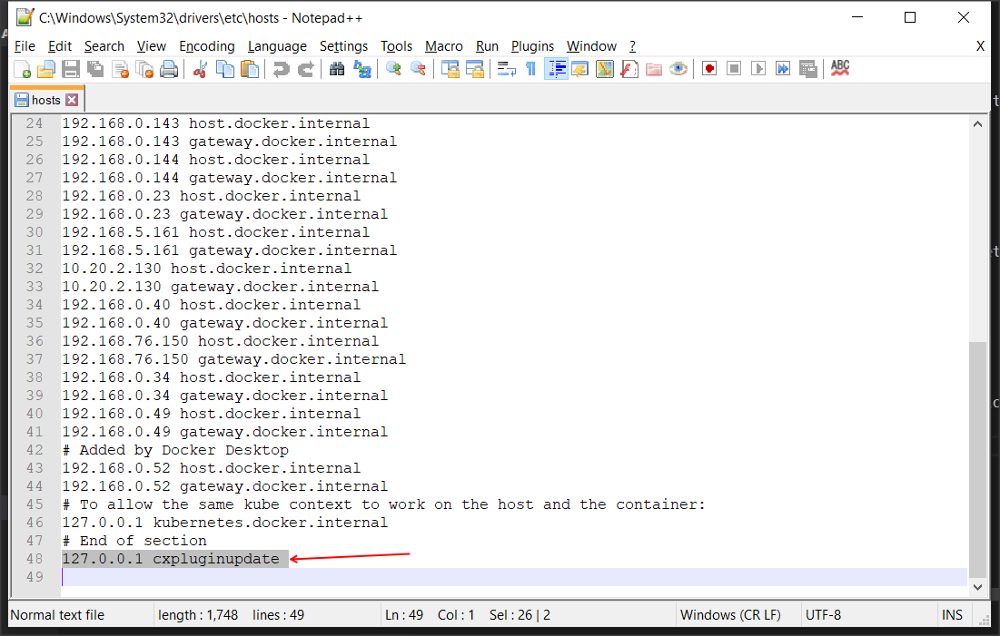

### The Web Server

There are several choices for installing a web server on your _cxpluginupdate_ host:

* Install IIS with directory browsing enabled.
* Run the Docker container web server provided in [the test_webserver directory](test_webserver)).

The plugin update [binaries](TEST_BINARIES) should be placed in the root directory of the web server.

If the option you have chosen is working correctly, you should be able to navigate to [http://cxpluginupdate](http://cxpluginupdate) and see a listing of files located in the directory as shown in the image below.

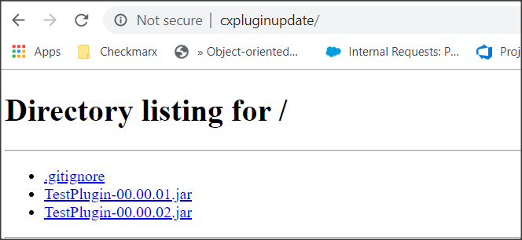


**NOTE:**  It is not possible to run both IIS and the Docker container web server at the same time.  You will get error messages such as "port is in use by another process" when you start one of the options.  If you have an existing IIS installation but decide to use the Docker container web server, you may need to stop IIS or bind it to a port other than 80.

#### Installing IIS with Directory Browsing

1. Open the **Internet Information Services Manager**
2. Select the site that will be serving the update plugins and double click the **directory browsing** applet (shown in the picture below)
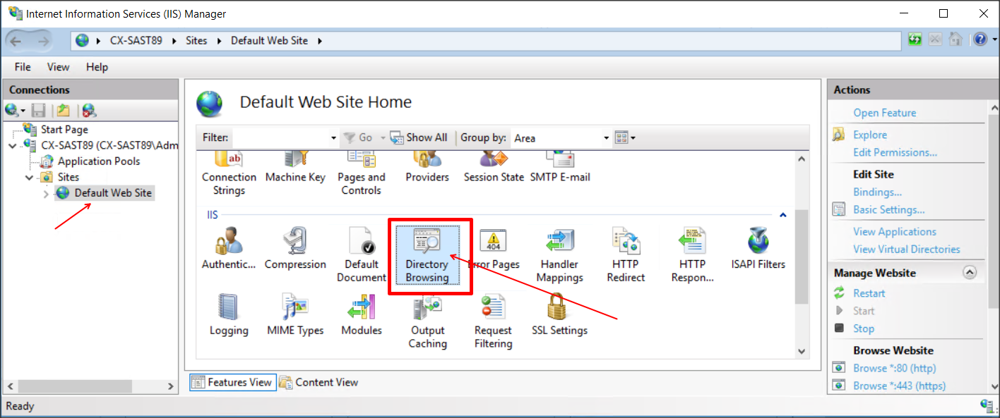

3. Click "Enable" to enable the directory browsing, apply the settings.

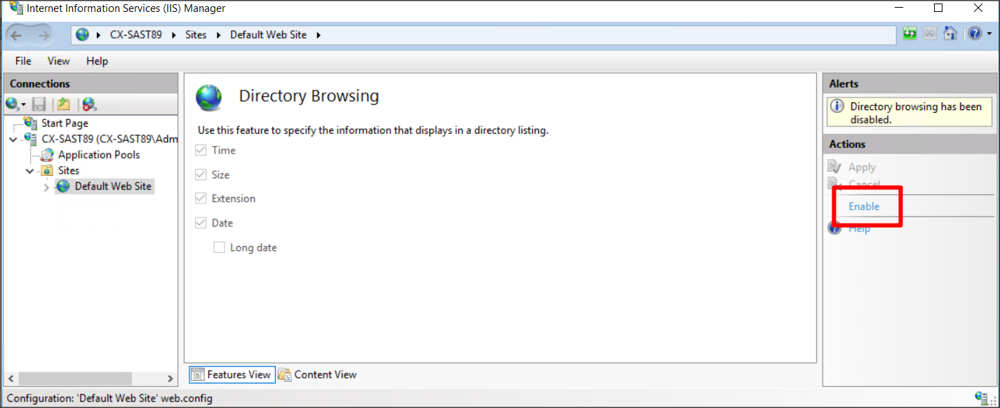

#### Using the Docker Container Web Server

Please look at the [README.md](test_webserver) in the **test_webserver** folder for instructions about how to use the Dockerized test web server.

## Testing Plugin Updates

If the _cxpluginupdate_ server is properly serving the plugin update binaries, you can test the plugin updates.

### Testing Eclipse Plugin Updates

1. Download a recent version of the [Eclipse IDE](https://www.eclipse.org/downloads/packages/release/2019-06/r/eclipse-ide-java-developers).  It is suggested that you run it from the standalone package rather than using the Windows installer. 

    * You may also need to install the [JDK](https://www.oracle.com/java/technologies/jdk8-downloads.html); this has been tested with JDK 1.8.

2. This example uses the **eclipse/dropins** folder to simulate plugin updates.  (Full plugins that are installed through the Eclipse software manager are a bit more complex to build, but the effect of the plugin update would be similar to this example.)  Drop the file [TestPlugin-00.00.01.jar](TEST_BINARIES/eclipse) into the **eclipse/dropins** folder.

3. Open powershell in the **eclipse** directory and execute the ``.\eclipse -clean`` command to start Eclipse.

4. On startup, the version check starts in the background.  You can navigate to the **CxPlugin Update->Current Version** menu item to view the currently installed version.

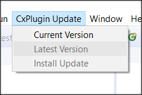

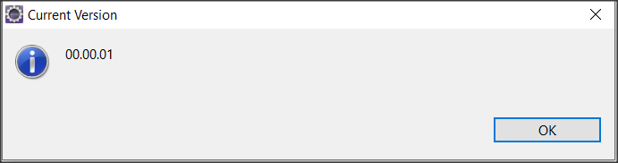

5. If the web server is working properly, a dialog will show that indicates a new version is available.

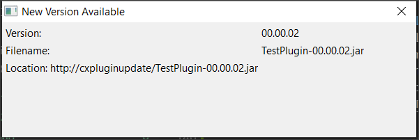


6. The **CxPlugin Update->Latest Version** and **CxPlugin Update->Install Update** are now enabled (since a new version has been detected).

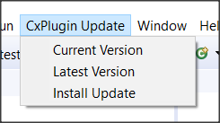

7. Choosing **CxPlugin Update->Latest Version** will show the latest version of the plugin available.

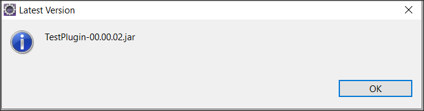

8. Choosing **CxPlugin Update->Install Update** will start the install of the new plugin.

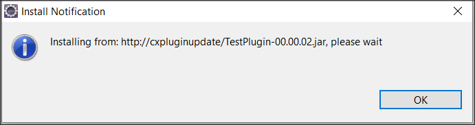

9. When the update is complete, you will see a dialog indicating that Eclipse needs to be restarted.

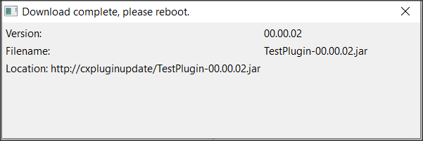

10. Restart Eclipse, using the same command to start (``.\eclipse -clean``)

11. When Eclipse starts, selecting **CxPlugin Update->Current Version** will show that the new version has been installed.  Also note that **CxPlugin Update->Latest Version** and **CxPlugin Update->Install Update** are disabled since no newer update has been detected.


### Testing Visual Studio Updates

1.Unzip the CXPlugin_01.01.01.zip and double click the .vsix file to install the extension on your Visual Studio 2017 (only tested with this version).

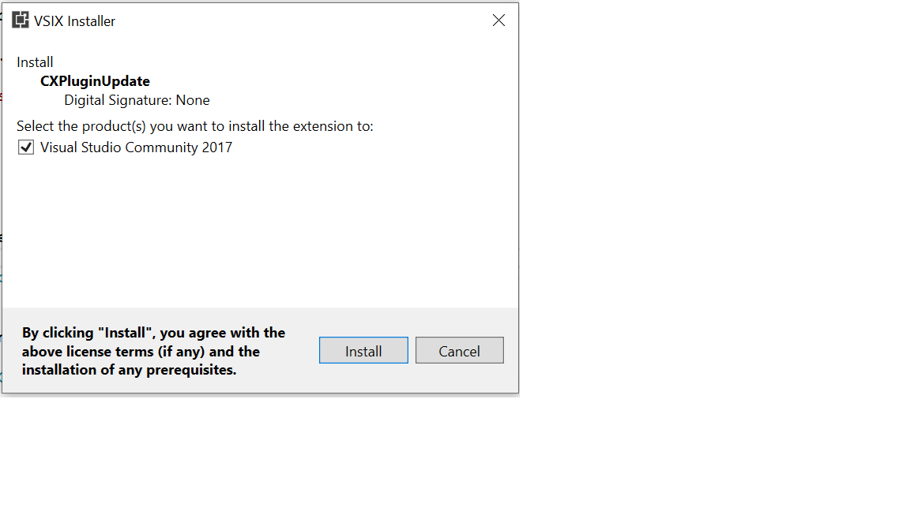

2. During installation close all instances of Visual studio .
3.once installation completes , you should be able to see the extension installed . open Visual Studio ->tools->extension and updates.

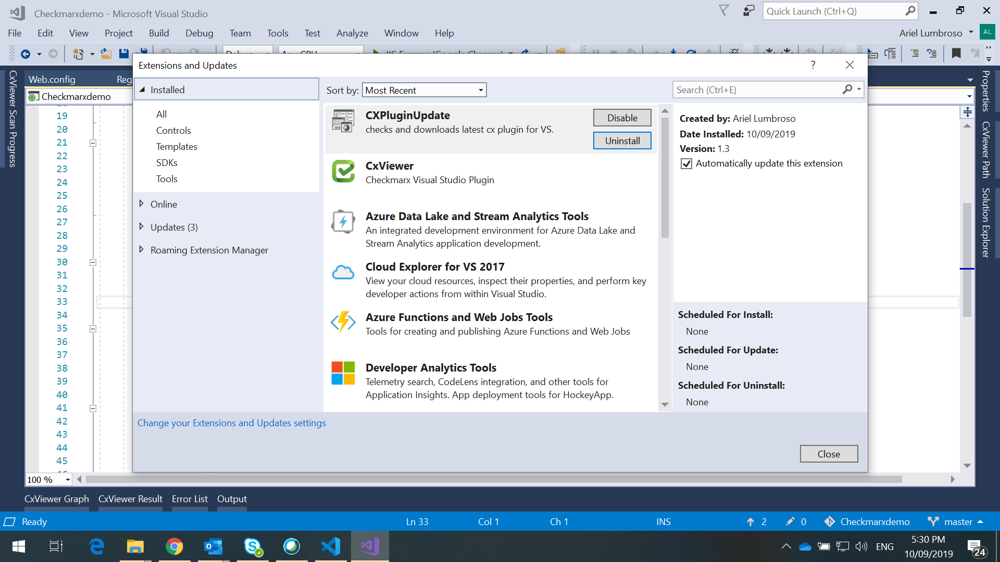

3.Open a project of your choice in Visual Studio to check for new CX plugins.you should be able to right click the project (important to select the project only) and see the command to check for new updates.

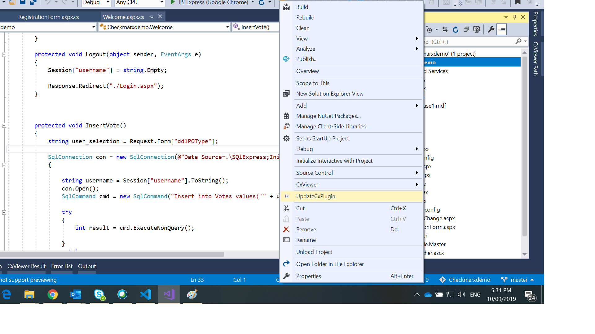

4.The plugin will prompt you if you wish to look for new updates . press ok if you wish to proceed.

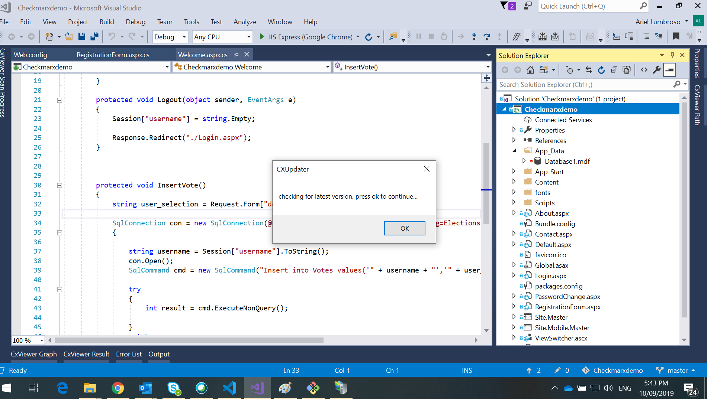

5.Before installation , you are prompted to confirm the installation . click ok to proceed .

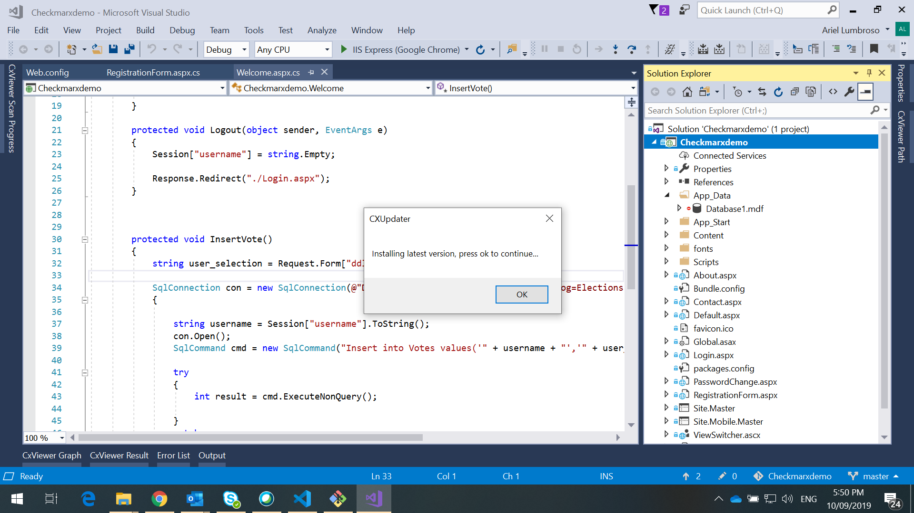

6.The plugin installation wizard will open .follow the wizard to upgrade the plugin .

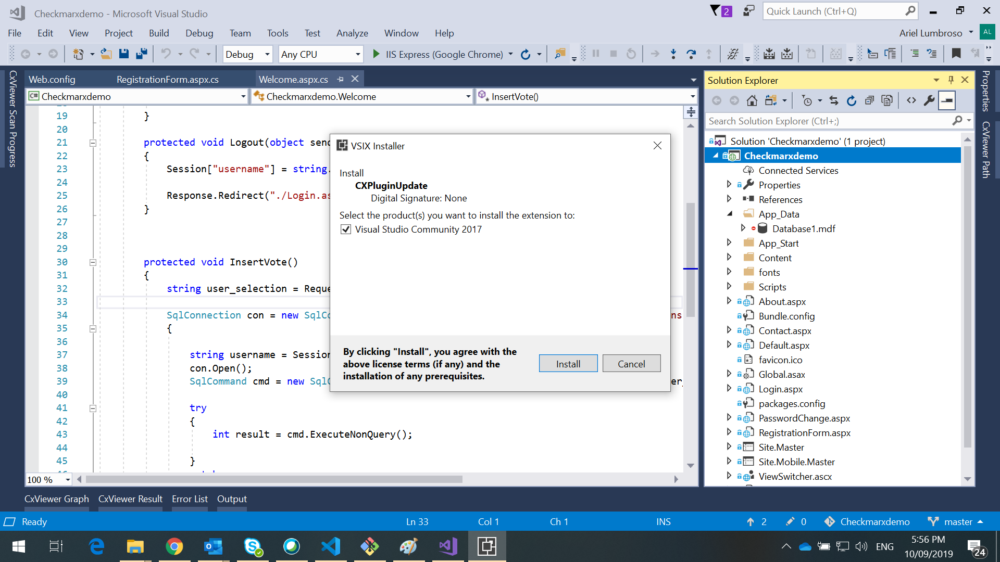


## Testing the Update Logic

The .jar files for the Eclipse plugin have a command line test capability.  To execute the command line test:

```
> java -jar .\TestPlugin-00.00.01.jar

usage: cmdtest [OPTIONS]
 -?,--help                        Print argument usage help.
 -d,--domain <domain suffix>      Add search domain suffix. Maybe
                                  repeated, also accepts multiple
                                  arguments.
 -g,--regex-group <group name>    A named group extracted with the regex
                                  match. This will be displayed if group
                                  matches are found. Maybe repeated, also
                                  accepts multiple arguments.
 -h,--host <arg>                  Override the default hostname used to
                                  find where the updates are hosted.
                                  Defaults to "cxpluginupdate".
    --max-dl-mbytes <megabytes>   The maximum size, in megabytes, for the
                                  plugin to allow download.
    --no-download                 Do not download the latest version of
                                  the plugin detected through the version
                                  resolution.
    --regex <arg>                 The regular expression used to detect
                                  matches in listing entries returned from
                                  the update host.
    --regex-name <arg>            The name of the property holding the
                                  regular expression in the regular
                                  expression properties file.
    --regex-props <file path>     A path to a .properties file containing
                                  regular expressions assigned to
                                  individual properties.
 -s,--skip-local                  Skip domain suffix resolution of domain
                                  suffixes assigned to network adapters on
                                  local machine.
 -t,--timeout <seconds>           Timeout for discovering available
                                  updates. Default: 60 seconds

```

An example execution shows the logic to find the latest version of a plugin binary and download it:

```
> java -jar .\build\libs\TestPlugin-00.00.01.jar --regex-props .\cmdline_tester\regex.properties --regex-name jar-example 
-g major minor revision custom

Waiting for update check to respond....
Latest version retrieved.
LatestVersion: TestPlugin-00.00.02.jar (http://cxpluginupdate/TestPlugin-00.00.02.jar)
Matched groups:
Name: [major] Value: [00]
Name: [minor] Value: [00]
Name: [revision] Value: [02]
Name: [custom] Value: [null]
Progress Callback: Checking content length of /TestPlugin-00.00.02.jar
Progress Callback: Downloading 1MB
Progress Callback: Downloaded 10%
Progress Callback: Downloaded 30%
Progress Callback: Downloaded 70%
Progress Callback: Downloaded 80%
Progress Callback: Downloaded 100%
Download completed successfully

```

The plugin binary payload is downloaded to the current working directory.

